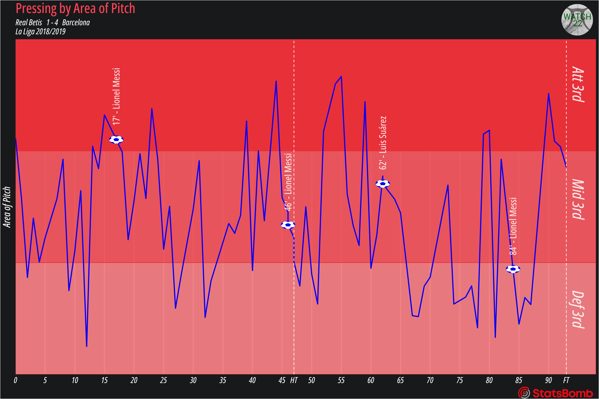

# Sight and Sound: What does pressing sound like?

Full article [here](https://medium.com/@watch22/sight-and-sound-what-does-pressing-sound-like-1f5aefcb06ed?source=user_profile---------1----------------------------)

Looking at Barcelona's 4-1 victory at Betis (the one with that insane Suarez assist), analysing their pressing game and attempting to give it a sound. In the article I go through the whole process from getting and cleaning the data to plotting and sonifying it.

Listen to the sonification of the above chart [here](https://www.youtube.com/watch?v=1qgjxrjI2SE)
